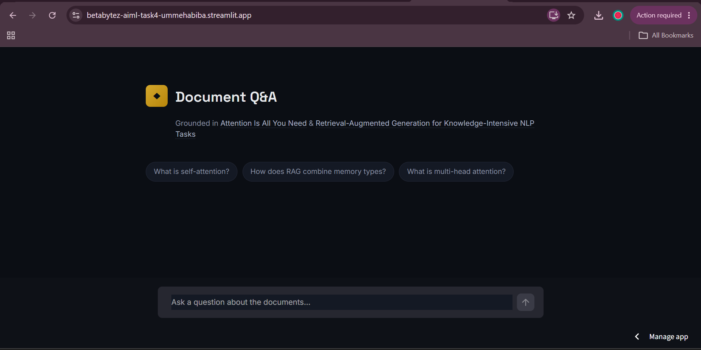
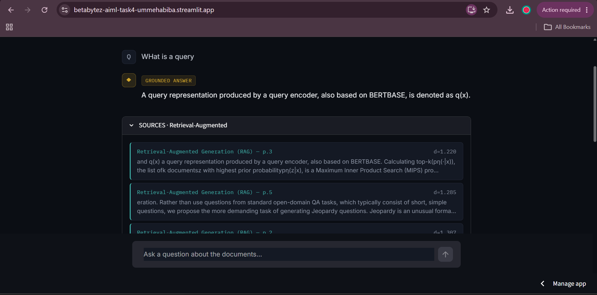
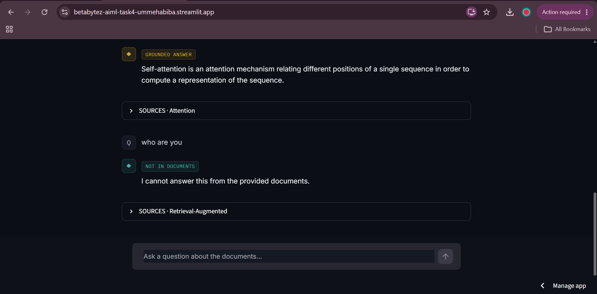

# RAG-Based Document Q&A Chatbot

**Prepared by Umme Habiba Malik · BetaBytez AI/ML Internship — Task 4**

A chatbot that answers questions strictly from a set of source documents, using
Retrieval-Augmented Generation (RAG) — instead of relying on what a language
model may have memorized during training, it looks up relevant passages first
and answers only from those passages. If the documents don't contain the
answer, the chatbot says so rather than guessing.

**Live demo:** https://betabytez-aiml-task4-ummehabiba.streamlit.app

---

## 1. Document Set

Two papers were chosen as the knowledge base:

- **"Attention Is All You Need"** (Vaswani et al., 2017) — the paper that introduced
  the Transformer architecture.
- **"Retrieval-Augmented Generation for Knowledge-Intensive NLP Tasks"** (Lewis et al., 2020)
  — the original RAG paper.

**Why these two:** they're related but distinct. The RAG paper builds directly on
Transformer concepts, so there's some natural topical overlap — but each paper also
covers ground the other doesn't (e.g. multi-head attention vs. dense passage
retrieval). This made it possible to test two different things at once: whether
the chatbot correctly retrieves from the *right* paper for a given question, and
whether it correctly refuses questions neither paper actually answers.

## 2. Chunking Strategy

Documents were split using LangChain's `RecursiveCharacterTextSplitter` with:

- **Chunk size: 700 characters**
- **Chunk overlap: 100 characters**

**Reasoning:** Academic papers write in dense, idea-per-paragraph style. 700
characters (roughly 150–200 words) is enough to hold one full explanation — like
a single paragraph on self-attention — without blending multiple unrelated ideas
into the same chunk. A smaller chunk size risked cutting an idea off mid-thought;
a much larger one would have diluted similarity search, since a chunk covering
several different topics doesn't score highly for any single query.

The 100-character overlap exists so that if an idea happens to fall right at a
chunk boundary, it still appears in full in at least one chunk — nothing gets
lost to an unlucky cut.

`RecursiveCharacterTextSplitter` was chosen over a plain fixed-length splitter
because it tries to break on paragraph breaks first, then sentences, then words
— only falling back to a hard character cut as a last resort. This keeps chunks
more coherent than blind character counting.

Ingesting the two PDFs (34 pages total) with this configuration produced **198
chunks**.

## 3. Embedding Model

**Model used:** `all-MiniLM-L6-v2` (via `sentence-transformers`)

**Reasoning:** This is a small (~80MB), fast model that maps each chunk to a
384-dimensional vector. It runs well on CPU with no GPU required — important
since this needed to work in both Google Colab's free tier and a local desktop
environment. It's also a well-established baseline for semantic search tasks.
Larger models (e.g. `all-mpnet-base-v2`) offer a small accuracy improvement but
run noticeably slower — not a meaningful trade-off for a document set of only
198 chunks.

## 4. Vector Database

**Choice: FAISS** (`faiss-cpu`), using `IndexFlatL2` (exact search via Euclidean distance).

**Reasoning:** FAISS is free, runs entirely locally with no server setup, and is
purpose-built for fast nearest-neighbor search over embeddings. For a document
set this size, exact search (`IndexFlatL2`) is fast enough that there was no
need for an approximate-search index — which meant no accuracy trade-off either.

The FAISS index and chunk metadata (source paper, page number) are saved to disk
and loaded once per session by the Streamlit app, rather than being rebuilt
every time the app starts.

## 5. Retrieval

Given a user's question, the same embedding model encodes the question into a
vector, and FAISS returns the **top k=4** most similar chunks.

**Why k=4:** Four chunks give the LLM enough surrounding context to piece
together a complete answer — even if the relevant information spans two or
three paragraphs — without flooding the prompt with unrelated material that
could dilute or confuse the answer.

## 6. Generation

**LLM used:** Llama 3.1 8B Instant, via the **Groq API** (free tier).

**Reasoning:** Groq's free tier runs open models at very high inference speed
at no cost — a good fit for a student project. The model doesn't need to be
large, since it isn't being asked to reason from scratch; it's being asked to
read and summarize text that's handed to it directly, which even a smaller
instruction-following model handles well.

The retrieved chunks are inserted into a system prompt that explicitly
instructs the model to answer **only** from the provided context, and to say
so plainly if the answer isn't present, rather than fall back on its own
training knowledge.

## 7. Grounding Check

Two safeguards work together to prevent hallucination:

1. **Distance threshold (pre-filter):** if even the closest retrieved chunk's
   similarity distance is above `1.5`, the question is treated as clearly
   unrelated to either document, and the chatbot returns a refusal immediately
   — without even calling the LLM. This also saves an API call for obviously
   out-of-scope questions.

2. **Prompt-level refusal (LLM judgment):** for questions that pass the
   distance filter (meaning retrieval found *something* plausible-looking),
   the system prompt instructs the model to refuse if the retrieved context
   doesn't actually answer the question.

**Why both layers were needed, not just one:** during testing, a question
about the RAG paper's exact GPU training cost in dollars retrieved chunks
about GPU hardware and training time (distance ≈ 1.17 — well under the 1.5
threshold), because the topic was plausible enough that FAISS found "close"
matches. The distance filter alone would have let this question through to
the LLM. It was the **second layer** — the LLM correctly noticing that a
dollar figure was never actually stated anywhere in the retrieved text — that
caught it. This confirmed that distance alone isn't a reliable filter for
every kind of out-of-scope question; the two layers catch different failure
modes.

## 8. Test Results

Five questions were tested against the deployed chatbot: three the documents
can answer, and two they cannot. Answers below are reported exactly as the
chatbot produced them.

### In-scope questions

**1. "What is self-attention?"**
> Self-attention, sometimes called intra-attention, is an attention mechanism
> relating different positions of a single sequence in order to compute a
> representation of the sequence.

**Sources:** Attention Is All You Need — pages 2, 6, 14, 15
**Result:** ✅ Grounded, correctly answered from the Transformer paper.

**2. "How does retrieval-augmented generation combine parametric and non-parametric memory?"**
According to the provided context, retrieval-augmented generation (RAG) combines pre-trained parametric and non-parametric memory for language generation. Specifically, the parametric memory is a pre-trained sequence-to-sequence (seq2seq) transformer, and the non-parametric memory is a dense vector index of Wikipedia, accessed with a pre-trained neural retriever (Dense Passage Retriever [26], henceforth DPR). These components are combined in a probabilistic model trained end-to-end.

**Sources:** Retrieval-Augmented Generation (RAG) — pages 1, 2, 9
**Result:** ✅ Grounded, correctly answered from the RAG paper.

**3. "What datasets did the RAG paper use to evaluate open-domain question answering?"**
> The RAG paper used the following datasets to evaluate open-domain question
> answering: 1. MSMARCO, 2. Natural Questions, 3. WebQuestions, 4. TriviaQA.

**Result:** ✅ Grounded, correctly answered from the RAG paper.

### Out-of-scope questions

**4. "What is the capital of France?"**
> I cannot answer this from the provided documents.

**Distances:** 1.74–1.75 (well above the 1.5 threshold)
**Result:** ✅ Correctly refused — caught by the **distance filter**; the LLM
was never called for this question.

**5. "What was the exact GPU training cost in dollars for the RAG paper's experiments?"**
> I cannot answer this from the provided documents.

**Distances:** 1.17–1.36 (below the 1.5 threshold — retrieval found
topically-related chunks about GPU hardware and training time, but no dollar
figure)
**Result:** ✅ Correctly refused — this time caught by the **LLM's own
judgment**, not the distance filter, since the retrieved chunks were close
enough in topic to pass the pre-filter. This is the more interesting result
of the two refusals, since it shows the system resisting a plausible-sounding
but ungrounded answer rather than just refusing anything unrelated.

## 9. Tech Stack Summary

| Component | Choice |
|---|---|
| Document loading | `PyPDFLoader` (LangChain) |
| Chunking | `RecursiveCharacterTextSplitter`, 700/100 |
| Embeddings | `all-MiniLM-L6-v2` (sentence-transformers) |
| Vector store | FAISS (`IndexFlatL2`) |
| LLM | Llama 3.1 8B Instant via Groq API |
| UI | Streamlit |
| Deployment | Streamlit Community Cloud |

## 10. Repository Structure

```
betabytez-aiml-task4-ummehabiba/
├── README.md
├── requirements.txt
├── notebook.ipynb              # full pipeline: ingestion → generation
├── app/
│   └── streamlit_app.py        # deployed chat UI
├── data/                       # source PDFs
├── faiss_index/                # saved index + chunk metadata
├── test_results/
│   └── test_questions_and_answers.md
└── screenshots/
```# betabytez-aiml-task4-UmmeHabiba
## Screenshots




GITHUB LINK :  https://github.com/ummehabiba-m/betabytez-aiml-task4-UmmeHabiba

